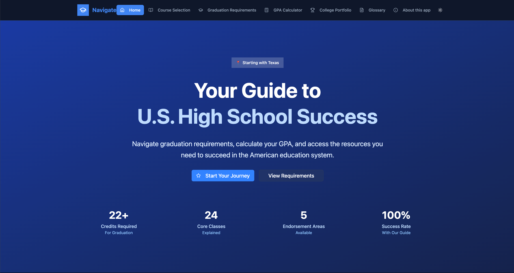

#  Navigate  

🔗 **Try it here:** [Navigate on Figma](https://toad-nit-40004345.figma.site/)  

**Navigate** is a web-based application built to guide students through the U.S. high school system.  
It’s designed especially for **immigrant students** new to the U.S. and **middle schoolers transitioning to high school**, giving them one place to understand courses, GPA, graduation requirements, and college prep resources.  

---

## 📷 Preview  

---

##  Inspiration  
When I moved to the U.S. in 10th grade, I realized how overwhelming the high school system can be — credits, STAAR tests, course types, endorsements, GPA, and college prep were all new to me. Many students, especially newcomers, face these same challenges.  
I built **Navigate** to break these barriers, simplify the system, and give students confidence in planning their high school journey.  

---

##  What it does  
Navigate brings everything students need into one place:  

-  **Course Selection Guide** – Explains differences between standard, honors, AP, IB, and college-level courses. Helps with elective choices and shows how courses impact GPA and college plans.  
-  **Graduation Requirements** – Breaks down total credits, STAAR tests, endorsements, and programs. Students can track what’s done and what’s left.  
-  **GPA Calculator** – Input weighted and unweighted courses by type (standard, honors, AP, IB) and instantly see GPA impact.  
-  **College Portfolio & Prep** – Covers extracurriculars, volunteering, internships, resume building (with templates), and SAT/ACT prep resources.  
-  **Glossary** – Defines key terms like GPA, class rank, credits, etc., in simple language.  
-  **Filter & Quick Links** – Makes it easy to find the information or opportunities students care about most.  

---

##  How I built it  

I built Navigate using `Figma AI` assistance to generate the starting code and then customized it.  

### Languages & Frameworks  
- **TypeScript (React + JSX/TSX)** – Core frontend logic & components  
- **JavaScript (compiled)** – Underlying build output  
- **HTML5** – Entry point (`index.html`)  
- **CSS3 + Tailwind CSS** – Styling with utility-first design  

### Libraries & Tools  
- **React 18.3.1** – Main frontend framework  
- **Vite 6.3.5** – Fast dev server & build tool  
- **Radix UI** – Accessible UI components  
- **Lucide React** – Icon library  
- **Recharts** – GPA visualizations  
- **React Hook Form** – Easy form handling  
- **Next Themes** – Light/Dark theme support  

### Development Process  
1. **Wireframing & UI Design** – Started in Figma, ensuring a student-friendly and intuitive layout.  
2. **Frontend Build** – Developed React components in TypeScript with Tailwind for clean, responsive styling.  
3. **Feature Implementation** – Added course guide, graduation tracker, GPA calculator, and college prep resources.  
4. **Polish** – Integrated filters, glossary, and external links to make it truly useful in real-world scenarios.  

---

##  Challenges I ran into  
- Organizing a huge amount of information without overwhelming users.  
- Translating complex academic requirements into clear, student-friendly language.  
- Making tools like the GPA calculator accurate and intuitive.  

---

##  Accomplishments I'm proud of  
- Building an app **from a student’s perspective** while still in high school.  
- Bringing together course planning, GPA tools, graduation tracking, and college prep in one platform.  
- Designing with **immigrant students** in mind, so the app truly addresses real needs.  

---

##  What I learnt  
- Empathy in design is key — tools must feel approachable, not intimidating.  
- Breaking down education jargon into plain words makes a huge difference.  
- The U.S. education system is complex, but with the right tools, students can navigate it with confidence.  

---

##  What’s next for Navigate  
-  **Multilingual Support** – Making it easier for students and families who aren’t fluent in English.  
-  **Scholarship & Financial Aid Tools** – Expanding the college prep section.  
-  **Mobile Compatibility** – Future updates may extend usability beyond computers.  

---

##  Compatibility Note  
Navigate is a **web-based application** built for **laptops, desktops, and PCs**.  
⚠️ It is **not compatible with mobile devices** at this time.    

---

## 👩‍💻 Developer  
**Sanjana Sunkara**  
Senior at Westwood High School, Round Rock, TX  
Passionate about making education more accessible for students everywhere.  
